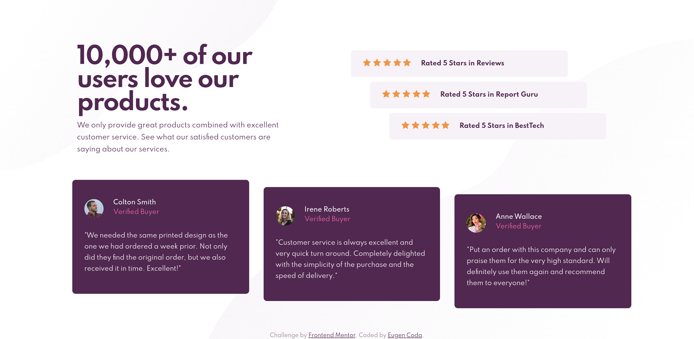
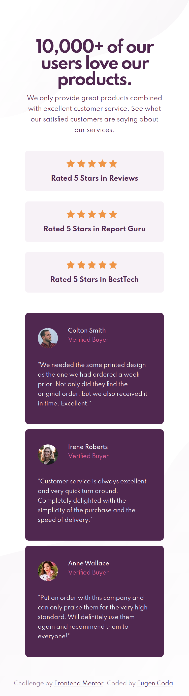

# Frontend Mentor - Social proof section solution

This is a solution to the [Social proof section challenge on Frontend Mentor](https://www.frontendmentor.io/challenges/social-proof-section-6e0qTv_bA). Frontend Mentor challenges help you improve your coding skills by building realistic projects.

## Table of contents

- [Overview](#overview)
  - [The challenge](#the-challenge)
  - [Screenshot](#screenshot)
  - [Links](#links)
- [My process](#my-process)
  - [Built with](#built-with)
  - [Useful resources](#useful-resources)
- [Author](#author)

## Overview

### The challenge

Users should be able to:

- View the optimal layout for the section depending on their device's screen size

### Screenshot

### Links

- Solution URL: [GitHub Repository](https://github.com/EugenCoda/frontend-mentor-social-proof-section)
- Live Site URL: [Social Proof Section](https://social-proof-section-frontend-challenge.netlify.app/)

## My process

### Built with

- Semantic HTML5 markup
- CSS custom properties
- Flexbox
- CSS Grid

### Useful resources

- [w3schools - CSS Flexbox](https://www.w3schools.com/css/css3_flexbox.asp)
- [w3schools - CSS Grid](https://www.w3schools.com/css/css_grid.asp)

## Author

- Website - [Eugen Coda](https://eugencoda.github.io/)
- Frontend Mentor - [@EugenCoda](https://www.frontendmentor.io/profile/EugenCoda)
- Twitter - [@coda_eugen](https://www.twitter.com/coda_eugen)
